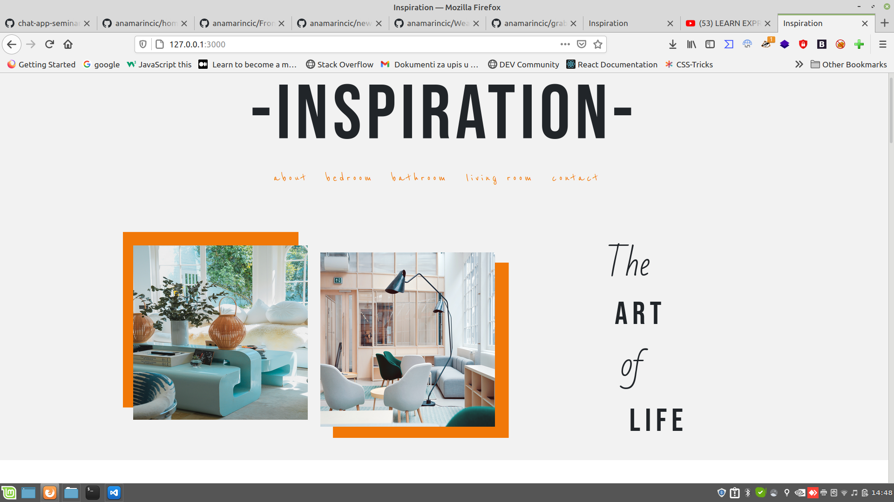
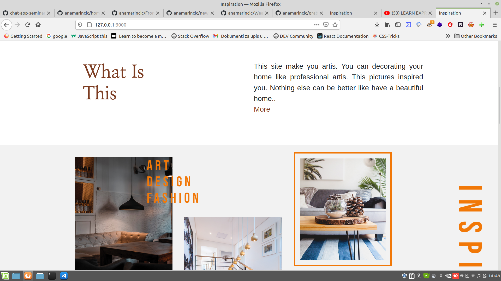
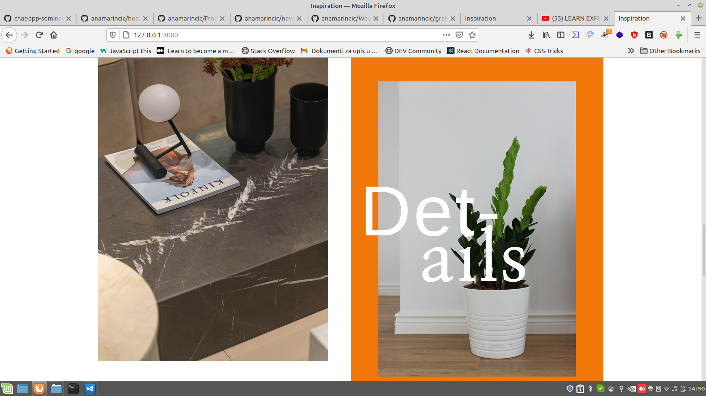
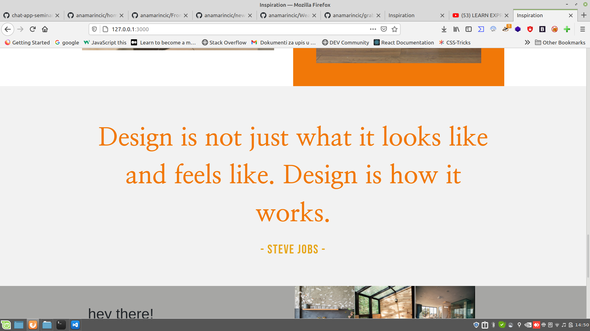
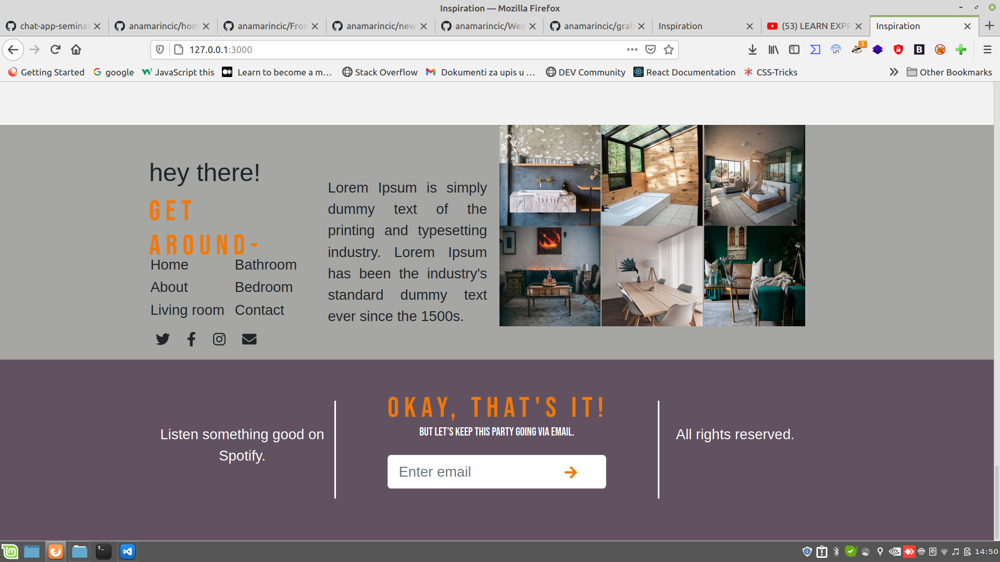

# Home-decoartion app

This site represent design that I love. Design is fresh,clean and minimalistic.

---

## Getting started

**Technologies**

- HTML
- CSS
- Javascript

**Requirements**

- Node.js 16.0.0+
- npm 7.10.0+
- express 4.17.1
- body-parser 1.19.0
- ejs 3.1.5
- request 2.88.2

**First steps**

1. Clone this repository
2. Run `npm start`

## Scripts

### `npm start`

Run the server on localhost:3000.
